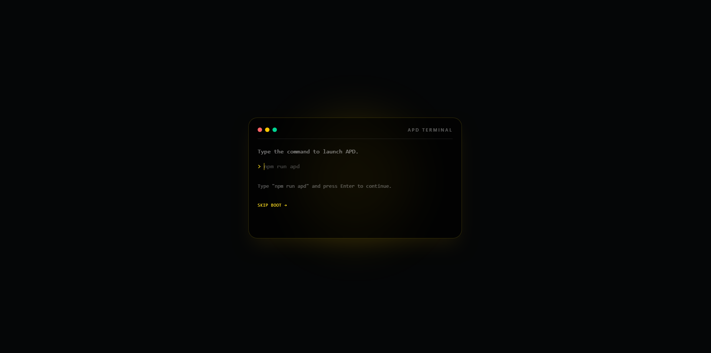

# APD Website

[](https://apd-website-rho.vercel.app)

## Preview

### APD Terminal Boot



### APD Website


Official website of the **Assemblage of Programmers and Developers (APD)**, the student technology organization of **FEU Diliman**.

The website highlights APD's projects, officers, events, community activities, achievements, and organizational history while serving as APD's official online presence.

---

## Features

- Responsive design for desktop and mobile
- APD Terminal boot experience
- Community highlights and media gallery
- Featured projects showcase
- Officer directory with profile links
- Events and recognition sections
- APD history and organization highlights
- Contact and community links
- SEO and Open Graph support

---

## Tech Stack

- React
- TypeScript
- Vite
- Tailwind CSS
- Framer Motion
- Lucide React

---

## Getting Started

Clone the repository:

```bash
git clone https://github.com/Zekiroh/apd-website.git
cd apd-website
```

Install dependencies:

```bash
npm install
```

Start the development server:

```bash
npm run dev
```

Build for production:

```bash
npm run build
```

---

## Roadmap

Future improvements include:

- Dynamic events
- Dynamic projects
- Contact form integration
- CMS support
- APD Connect integration

---

## Organization

**Assemblage of Programmers and Developers (APD)**

FEU Diliman

Official student organization dedicated to programming, software development, innovation, collaboration, and student growth through projects, events, and community-driven learning.

---

## License

Developed for the Assemblage of Programmers and Developers (APD).